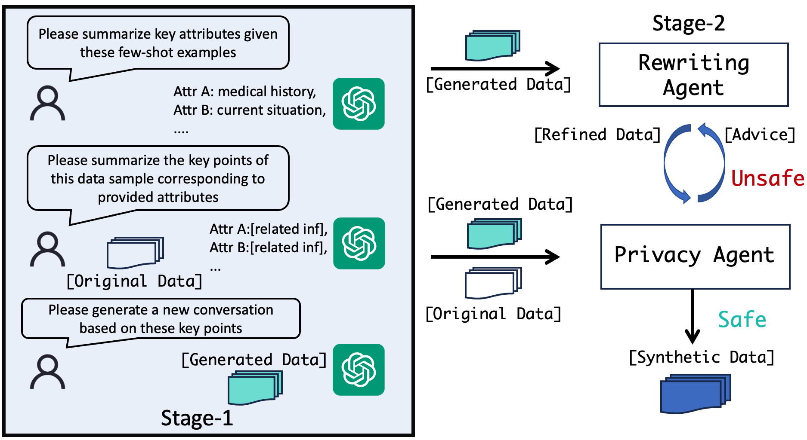

# RAG-SAGE

Our paper is available at [Mitigating the Privacy Issues in Retrieval-Augmented Generation (RAG) via Pure Synthetic Data](https://arxiv.org/abs/2406.14773).

## Abstract

Retrieval-augmented generation (RAG) enhances the outputs of language models by integrating relevant information retrieved from external knowledge sources. However, when the retrieval process involves private data, RAG systems may face severe privacy risks, potentially leading to the leakage of sensitive information. To address this issue, we propose using synthetic data as a privacy-preserving alternative for the retrieval data. We propose SAGE, a novel two-stage synthetic data generation paradigm. In the stage-1, we employ an attribute-based extraction and generation approach to preserve key contextual information from the original data. In the stage-2, we further enhance the privacy properties of the synthetic data through an agent-based iterative refinement process. Extensive experiments demonstrate that using our synthetic data as the retrieval context achieves comparable performance to using the original data while substantially reducing privacy risks. Our work takes the first step towards investigating the possibility of generating high-utility and privacy-preserving synthetic data for RAG, opening up new opportunities for the safe application of RAG systems in various domains.



## Environmental installation

First, I suggest manually installing GPU-related libraries, selecting the version that is compatible with your CUDA version. You can find the compatible version at [torch install guide](https://pytorch.org/).

```
pip3 install torch torchvision torchaudio
```

Then, install the specific packages individually:

```
pip install langchain langchain_community langchain_openai nltk tqdm openai chardet autogen datasets ragas spacy urlextract transformers rouge_score
```

## About the data

You can find our pre-processed dataset via the [google drive link](https://drive.google.com/drive/folders/1zdAilQPhLqmw9wzv7hNn7JkewHAInjkZ?usp=sharing).

Please unzip the datasets to the `.\Data` folder, you may find the following file structure.

```
|-- Data
    |-- chat
    |-- enron
    |-- wiki
```

You can also find the origin datasets here: [chatdoctor](https://huggingface.co/datasets/LinhDuong/chatdoctor-200k), [wikitext-103-raw-v1](https://huggingface.co/datasets/wikitext) and [enron-mail](https://www.cs.cmu.edu/~enron/).

## Quick Start

There are 5 steps to run our experiment: retrieval database, get origin context, doing protect, final output and evaluation. Below is a brief introduction on how to run these Python script files, with detailed comments available for reference in each file.

### 1. retrieval database

You can use the following code to construct the database, it need to run only once.

```
export CUDA_VISIBLE_DEVICES=1
python retrieval_database.py
```

### 2. get origin context

You can run this file by running following codes:

```
export CUDA_VISIBLE_DEVICES=1
python get_origin_context.py --dataset_name="chat" --attack_method="per"
```

where dataset_name denotes the dataset we use and attack_method is the attacking method or performance.

The following combinations are legal:

```
python get_origin_context.py --dataset_name="chat" --attack_method="per"
python get_origin_context.py --dataset_name="wiki" --attack_method="per"
python get_origin_context.py --dataset_name="chatdoctor" --attack_method="target"
python get_origin_context.py --dataset_name="chatdoctor" --attack_method="untarget"
python get_origin_context.py --dataset_name="wiki_pii" --attack_method="target"
python get_origin_context.py --dataset_name="wiki_pii" --attack_method="untarget"
```

### 3.doing protect

In this step, we provide our proposed method and 3 baseline for comparison, you can run the following:

```
python doing_protect.py \
--protect-method="sync" \
--dataset-name="chatdoctor"
--attack-method="target"
--synthetic-llm="gpt-35-turbo"
```

It is worth noting that you need to fit the following 2 functions according to the type of API you are using: `get_llm_client` and `get_llm_output`.

### final output 

Similar to step 3, you can run the following:

```
python final_output.py \
--protect-method="sync" \
--dataset-name="chatdoctor"
--attack-method="target"
--llm-generations="gpt-35-turbo"
```

It is worth noting that you need to fit the following 2 functions according to the type of API you are using: `get_llm_client` and `get_llm_output`.

### evaluation

If you want to evaluate attack, please run:

```
python evaluation_attack.py \
--protect-method="sync" \
--dataset-name="chatdoctor"
--attack-method="target"
--model="gpt-35-turbo"
```

If you want to evaluate performance, please run:

```
python evaluation_performance.py \
--protect-method="sync" \
--dataset-name="chat"
--model="gpt-35-turbo"
```

Note that you should provide your LLM model and embedding.